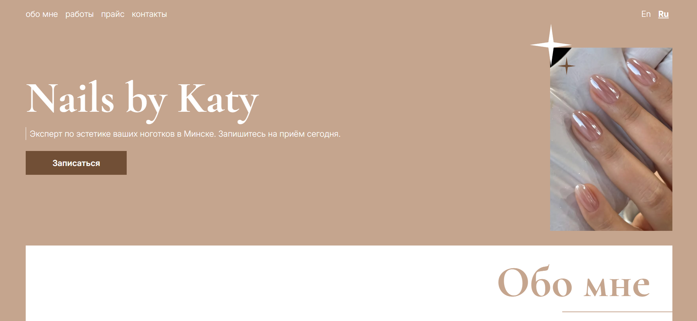

# 💅 Nails by Katy — Commercial Landing Page & Client Portal

A modern, high-performance, bilingual (EN/RU) commercial landing page built for an aesthetic nail technician in Minsk, Belarus. Designed to showcase portfolio works, highlight service pricing, and drive client conversions through direct social booking and email inquiries.

## 🔗 Links

**Live Demo:** [View Live Site](https://katyko-nails-salon.vercel.app/)  
**GitHub Repository:** [View Source Code](https://github.com/iviktorry/katyko-nails-salon)

---

## 🛠 Tech Stack

- **React 18** — Component-based architecture, hooks, and modular UI structure
- **Vite** — High-speed frontend build tooling and development environment
- **Tailwind CSS** — Modern utility-first CSS framework for custom responsive design
- **react-i18next** — Full internationalization (i18n) support for multi-language toggle (EN/RU)
- **yet-another-react-lightbox** — Full-screen responsive image gallery modal with touch-swipe support
- **Web3Forms API** — Serverless contact form handling with zero-backend email delivery
- **Lucide React** — Lightweight, clean vector iconography
- **Prettier & prettier-plugin-tailwindcss** — Automated code formatting and class sorting for clean codebase standards

---

## ✨ Key Features & Business Requirements

- **Bilingual Internationalization (i18n):** Native support for English and Russian languages via `react-i18next`, allowing both local clients and international portfolio viewers to browse comfortably.
- **Adaptive Portfolio Gallery Grid:** Responsive layout that intelligently adjusts the initial visible images based on screen width (Mobile: 2, Tablet: 3, Desktop: 5) with an extensible "Show More" accordion state.
- **Interactive Lightbox Preview:** Integrated `yet-another-react-lightbox` allowing clients to view high-resolution photos of nail artworks in full screen with swipe and keyboard navigation.
- **Serverless Direct Email Contact Form:** Custom asynchronous contact form utilizing `Web3Forms` API to route client inquiries directly to the owner's inbox without requiring a standalone backend server.
- **Accessibility-First Notification UI:** Features dynamic animated feedback overlays for form submissions configured with `aria-live="polite"` and `role="status"` for screen-reader accessibility.
- **Direct Conversion Pathways:** Integrated anchor navigation and quick-action call-to-actions (CTAs) directing potential clients directly to messenger booking links.

---

## 🧠 Engineering & Technical Wins

Building this commercial landing page provided hands-on experience in production-ready frontend workflows and real-world client constraints:

- **Serverless Form Handling & UX:** Implemented `fetch`-based POST requests to `Web3Forms` API with asynchronous error handling, loading states, and custom auto-dismissing (3-second timer) success feedback.
- **Complex Grid Logic:** Designed custom conditional rendering logic for gallery breakpoints to optimize content hierarchy and reduce visual clutter on mobile screens.
- **Component Scalability:** Abstracted reusable UI primitives (such as dynamic `Button` components that intelligently render as HTML `<button>` or `<a>` anchors based on passed props) to ensure clean HTML validation and zero nested interactive tags.
- **Code Quality & Maintenance:** Enforced `prettier-plugin-tailwindcss` within local workspace configurations to maintain strict class order standards across all React components.

---

## 🤝 Project Credits

| Entity        | Details                                                                    |
| :------------ | :------------------------------------------------------------------------- |
| **Client**    | **Katyko Nails Studio** (Minsk, Belarus) — Private Aesthetic Beauty Studio |
| **Developer** | **Victoria** — Frontend Developer                                          |

---

## 👩‍💻 Developer Contacts & Socials

<!--  -->
